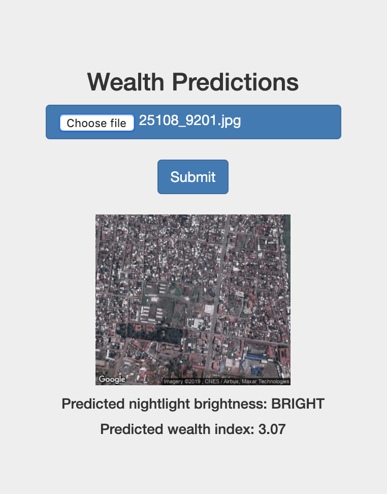

# poverty-classifier
This is a web app for classifying poverty levels from satellite images, as well as predicting nighttime luminosity values. It uses a Keras model and deploying it as a REST API with the Flask web framework. The hdf5 object file with weights of the trained CNN model is linked [here](https://drive.google.com/drive/folders/1BAJDuZ4kadwS76rjv7it2n0CzULiwZpE?usp=sharing).

## Getting started
* Clone the repository.
* `pip install -r requirements.txt`
## Run
* `python app.py`
* Open up a browser and go to `localhost:5000`.
* Upload and submit a daytime satellite image.

  

